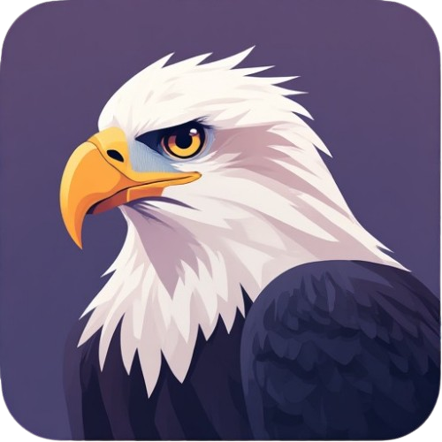

# EagleShot 🦅

> [🇬🇧 English](#english) | [🇹🇷 Türkçe](#türkçe)



---

## English

A lightweight, modern, cross-platform screenshot tool for Windows, macOS and Linux. Combines the speed of Lightshot with the advanced features of Greenshot in a modern interface.

### 🌟 Features

- **Cross-Platform:** Windows, macOS and Linux from a single codebase.
- **Lightweight:** Built with Avalonia UI and .NET 9, minimal resource usage.
- **Modern UI:** Fluent Design dark theme with rounded corners, shadows and SVG icons.
- **Auto-Start:** Optionally launch on system startup (toggle from tray menu).
- **Smart Capture:**
  - Region selection by dragging
  - Live pixel dimensions while selecting
  - Multi-monitor support
- **Annotation Tools:**
  - 🖊️ Pen — Freehand drawing
  - / Line — Straight lines
  - ➔ Arrow — Directional arrows
  - ⬜ Rectangle — Area framing
  - 📝 Text — Inline text with **A+** / **A-** size controls
  - 🔦 Highlight — Semi-transparent yellow overlay
  - **#** Number — Sequential numbered markers
  - 🟦 Mosaic — Pixelate sensitive information
- **Color Picker:** 18-color palette via flyout popup.
- **Pen Width:** 1px, 3px, 5px, 8px options.
- **Output:**
  - 💾 Save to file (PNG / JPG)
  - 📋 Copy to clipboard (works on all platforms)
  - ↩️ Undo

### 🚀 Installation

#### Windows

**Using the installer:**
1. Download `EagleShot_Setup_v2.0.0_win-x64.exe` from [Releases](https://github.com/hhasanguclu/EagleShot/releases).
2. Run the installer and follow the steps.

**Manual:**
```bash
dotnet publish -c Release -r win-x64 --self-contained true -p:PublishSingleFile=true -o publish/win-x64
```

#### Linux

```bash
# Build
dotnet publish -c Release -r linux-x64 --self-contained true -p:PublishSingleFile=true -o publish/linux-x64

# Install
chmod +x installers/linux/install.sh
./installers/linux/install.sh
```

Dependencies: `xclip` or `wl-copy` (clipboard), `scrot` or `gnome-screenshot` (screen capture).

#### macOS

```bash
# Build (Apple Silicon)
dotnet publish -c Release -r osx-arm64 --self-contained true -p:PublishSingleFile=true -o publish/osx-arm64

# Create .app bundle
chmod +x installers/macos/create-app.sh
./installers/macos/create-app.sh
```

Drag `EagleShot.app` to `/Applications`.
On first launch, grant permission at **System Preferences > Privacy & Security > Screen Recording**.

#### Build from Source

```bash
git clone https://github.com/hhasanguclu/EagleShot.git
cd EagleShot
dotnet run
```

Build all platforms at once:
```bash
# PowerShell
./scripts/build-all.ps1

# Bash
chmod +x scripts/build-all.sh
./scripts/build-all.sh
```

### 🎮 Usage

1. The app sits in the system tray after launch.
2. Press **PrintScreen** (or **F12** on macOS) or click the tray icon.
3. The screen dims — drag to select a region.
4. A toolbar appears — annotate, draw, add text.
5. Click **Copy** or **Save**. Press **Escape** to cancel.

### 🛠️ Tech Stack

| | |
|---|---|
| Language | C# |
| UI Framework | Avalonia UI 11.2 (Fluent Theme) |
| Runtime | .NET 9.0 |
| Global Hotkey | SharpHook (cross-platform) |
| Screen Capture | Win32 GDI+ / scrot / screencapture |
| Clipboard | Win32 API / xclip / osascript |

---

## Türkçe

Windows, macOS ve Linux'ta çalışan, hafif, modern ve kullanıcı dostu bir ekran görüntüsü alma aracıdır. Lightshot'ın hızını ve Greenshot'ın gelişmiş özelliklerini modern bir arayüzle birleştirir.

### 🌟 Özellikler

- **Cross-Platform:** Windows, macOS ve Linux desteği — tek kod tabanı.
- **Hafif ve Hızlı:** Avalonia UI ve .NET 9 ile geliştirilmiştir, minimum kaynak kullanımı.
- **Modern Arayüz:** Fluent Design koyu tema, yuvarlatılmış köşeler, gölgeler, SVG ikonlar.
- **Otomatik Başlatma:** Sistem açılışında başlatma (tray menüsünden açılıp kapatılabilir).
- **Akıllı Yakalama:**
  - Sürükleyerek bölge seçimi
  - Seçim sırasında piksel boyut göstergesi
  - Çoklu monitör desteği
- **Düzenleme Araçları:**
  - 🖊️ Kalem — Serbest çizim
  - / Çizgi — Düz çizgi
  - ➔ Ok — Yön belirtme
  - ⬜ Dikdörtgen — Alan çerçeveleme
  - 📝 Metin — Inline metin, **A+** / **A-** ile boyut ayarı
  - 🔦 Vurgulama — Şeffaf sarı highlight
  - **#** Numara — Sıralı numaralı işaretçiler
  - 🟦 Mozaik — Hassas bilgileri pikselleştirme
- **Renk Seçici:** 18 renklik palette (flyout popup).
- **Kalem Kalınlığı:** 1px, 3px, 5px, 8px seçenekleri.
- **Çıktı:**
  - 💾 Dosyaya kaydet (PNG / JPG)
  - 📋 Panoya kopyala (tüm platformlarda çalışır)
  - ↩️ Geri al

### 🚀 Kurulum

#### Windows

**Installer ile:**
1. [Releases](https://github.com/hhasanguclu/EagleShot/releases) sayfasından `EagleShot_Setup_v2.0.0_win-x64.exe` indirin.
2. Installer'ı çalıştırın ve adımları takip edin.

**Manuel:**
```bash
dotnet publish -c Release -r win-x64 --self-contained true -p:PublishSingleFile=true -o publish/win-x64
```

#### Linux

```bash
# Derle
dotnet publish -c Release -r linux-x64 --self-contained true -p:PublishSingleFile=true -o publish/linux-x64

# Kur
chmod +x installers/linux/install.sh
./installers/linux/install.sh
```

Bağımlılıklar: `xclip` veya `wl-copy` (clipboard), `scrot` veya `gnome-screenshot` (ekran yakalama).

#### macOS

```bash
# Derle (Apple Silicon)
dotnet publish -c Release -r osx-arm64 --self-contained true -p:PublishSingleFile=true -o publish/osx-arm64

# .app bundle oluştur
chmod +x installers/macos/create-app.sh
./installers/macos/create-app.sh
```

`EagleShot.app` dosyasını `/Applications` klasörüne sürükleyin.
İlk çalıştırmada **System Preferences > Privacy & Security > Screen Recording** izni verin.

#### Kaynaktan Derleme

```bash
git clone https://github.com/hhasanguclu/EagleShot.git
cd EagleShot
dotnet run
```

Tüm platformlar için tek seferde:
```bash
# PowerShell
./scripts/build-all.ps1

# Bash
chmod +x scripts/build-all.sh
./scripts/build-all.sh
```

### 🎮 Kullanım

1. Uygulama sistem tepsisine yerleşir.
2. **PrintScreen** (macOS'ta **F12**) tuşuna basın veya tepsi ikonuna tıklayın.
3. Ekran kararır, fare ile alan seçin.
4. Araç çubuğu belirir — çizim yapın, metin ekleyin.
5. **Kopyala** veya **Kaydet** ile çıktı alın. **Escape** ile iptal edin.

### 🛠️ Teknolojiler

| | |
|---|---|
| Dil | C# |
| UI Framework | Avalonia UI 11.2 (Fluent Theme) |
| Runtime | .NET 9.0 |
| Global Hotkey | SharpHook (cross-platform) |
| Ekran Yakalama | Win32 GDI+ / scrot / screencapture |
| Clipboard | Win32 API / xclip / osascript |

---

## 📁 Project Structure / Proje Yapısı

```
EagleShot/
├── Core/
│   ├── AutoStartService.cs        # Platform-specific auto-start
│   ├── ClipboardService.cs        # Platform-specific clipboard
│   ├── GlobalHotkeyService.cs     # Cross-platform hotkey (SharpHook)
│   ├── ScreenCaptureService.cs    # Platform-specific screen capture
│   ├── Shapes.cs                  # Drawing shapes (Pen, Line, Arrow, Rect, Highlight)
│   ├── Shapes2.cs                 # Drawing shapes (Text, Number, Mosaic)
│   └── ToolType.cs                # Tool enum
├── Views/
│   ├── OverlayCanvas.cs           # Custom render + pointer handling
│   ├── OverlayWindow.axaml(.cs)   # Main overlay window + toolbar
│   └── SplashWindow.axaml(.cs)    # Splash screen
├── Styles/
│   └── AppStyles.axaml            # Modern UI styles
├── Resources/
│   ├── icon.ico
│   ├── logo.png
│   └── splash_logo.jpg
├── installers/
│   ├── windows/
│   │   └── setup.iss              # Windows Inno Setup script
│   ├── linux/
│   │   ├── install.sh             # Linux installer
│   │   └── uninstall.sh           # Linux uninstaller
│   └── macos/
│       └── create-app.sh          # macOS .app bundle creator
├── scripts/
│   ├── build-all.ps1              # PowerShell build script
│   └── build-all.sh               # Bash build script
├── App.axaml(.cs)                 # App entry, tray icon
├── Program.cs                     # Main entry point
└── README.md
```

## 📝 License / Lisans

This project is licensed under the MIT License. / Bu proje MIT Lisansı ile lisanslanmıştır.
